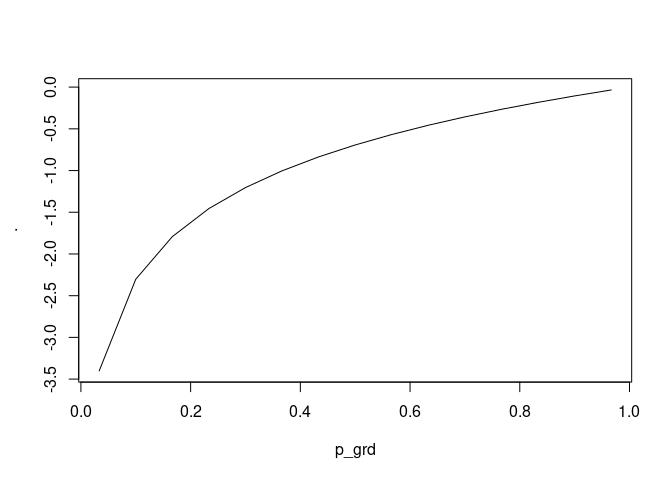

<!-- README.md is generated from README.Rmd. Please edit that file -->

# gilchrist <a href='https://dmi3kno.github.io/gilchrist'></a>

<!-- badges: start -->

[](https://lifecycle.r-lib.org/articles/stages.html#experimental)
<!-- badges: end -->

This package is made to honor the legacy and memory of Warren G.
Gilchrist (1932-2015)[^1].

The goal of `{gilchrist}` is to implement Gilchrist QF transformation
rules (Gilchrist 2000) in R in the form of pipeable function factories.

## Installation

You can install the development version of gilchrist like so:

``` r
remotes::install_packages("dmi3kno/gilchrist")
```

## Gilchrist’s QF transformation rules

Gilchrist (2000) list the following rules for creating new quantile
functions out of existing ones.

| Original QF       | Rule                    | Resulting QF      | Resulting variable                             |
|-------------------|-------------------------|-------------------|------------------------------------------------|
| $Q_Y(u)$          | Relection rule          | $-Q(1-u)$         | QF of $-Y$                                     |
| $Q_Y(u)$          | Reciprocal rule         | $1/Q(1-u)$        | QF of $1/Y$                                    |
| $Q_1(u),Q_2(u)$   | Addition rule           | $Q_1(u)+Q_2(u)$   | Valid QF                                       |
| $Q_1(u),Q_2(u)$   | Linear combination rule | $aQ_1(u)+bQ_2(u)$ | Valid QF for a,b\>0                            |
| $Q_1(u),Q_2(u)>0$ | Multiplication rule     | $Q_1(u)Q_2(u)$    | Valid QF if $Q_1(u),Q_2(u)>0$                  |
| $Q_Y(u)$          | Q-transformation        | $T(Q_Y(u))$       | QF of $T(Y)$, for non-decreasing $T$           |
| $Q_Y(u)$          | p-transformation        | $Q_Y(H(u))$       | p-transformed $Q_Y(u)$, for non-decreasing $H$ |

## Example

This is a basic example which shows you how to solve a common problem:

``` r
library(gilchrist)
library(magrittr)
## basic example code
```

In using and testing quantile function it is useful to have an
equi-spaced grid of probabilities

``` r
p_grd <- seq(0,1, length.out=7)
```

`{gilchrist}` is a special package! It uses magrittr pipe to operate not
on data, but on functions. It is a function factory engine!

### Exponential

Start with standard exponential quantile function. Note that this “basic
quantile function” has no parameters.

$$S(u)=-\ln(1-u)$$

The built-in equivalent in `{gilchrist}` is `sqf_exp()`. It is a regular
R function, so we can inspect it.

``` r
s_exp
#> function(u, ...){
#>   -log(1-u)
#> }
#> <bytecode: 0x55a4822e3180>
#> <environment: namespace:gilchrist>
```

We will now add a scale parameter to our basic exponential QF to make it
like in
[Wikipedia](https://en.wikipedia.org/wiki/Exponential_distribution).

$$Q(u)=\frac{1}{\lambda}[-\ln(1-u)]$$

In order to remember that our scale parameter should be reciprocated we
call it “ilambda”.

``` r
qf_exp <- s_exp %>% 
  qff_scale(nm_scale="lambda",.invert = TRUE)
```

We compare our hand-made exponential quantile function to the standard
function in R. Note that `qexp` has a reciprocated scale.

``` r
qf_exp(p_grd, lambda=1/10)
#> [1]  0.000000  1.823216  4.054651  6.931472 10.986123 17.917595       Inf
# compare to standard exponential quantile function. 
qexp(p_grd, 1/10)
#> [1]  0.000000  1.823216  4.054651  6.931472 10.986123 17.917595       Inf
```

`{gilchrist}` has several basic (parameterless) functions that you can
modify.

- `s_exp()`: Basic QF of exponential distribution
- `s_unif()`: Basic QF of uniform distribution
- `s_norm()`: Basic QF of normal distribution, a thinly wrapped
  `qnorm(u,0,1)`.
- `s_cauchy()`: Basic QF of Cauchy distribution.
- `s_halftriang()`⁠: Basic QF of half-triangular distribution.
- `s_halfcosine()`: Basic QF of half-cosine distribution
- `s_sech()`: Basic QF of hyperbolic secant distribution.

### Logistic

Let’s do a more challenging example. We will make a logistic
distribution in `{gilchrist}`. Logistic distribution consists of
exponential $-\ln(1-u)$ and reflected exponential $\ln(u)$
distributions.

$$Q(u)=\mu+s\ln\left(\frac{u}{1-u}\right)=\mu+s\left[\ln(u)-\ln(1-u)\right]$$
This is how we do it. Note that in the resulting quantile function, the
arguments have to always be named.

``` r
qf_logistic <- s_exp %>% 
  qff_add(
    s_exp %>% qff_reflect()
  ) %>% 
  qff_decorate("mu", "s")

qf_logistic(p_grd, mu=4, s=2)
#> [1]      -Inf 0.7811242 2.6137056 4.0000000 5.3862944 7.2188758       Inf
qlogis(p_grd, 4, 2)
#> [1]      -Inf 0.7811242 2.6137056 4.0000000 5.3862944 7.2188758       Inf
```

### Flattened Skew-Logistic

Can we add a little flatness to our newly made logistic distribution and
introduce the weights by the exponential components? Lets make Flattened
Skew-Logistic Distribution described in Sharma and Chakrabarty (2020).

$$Q(u)=\alpha+\beta[(1-\delta)\ln(u)-\delta\ln(1-u)+ku]$$

Note that the exponential distribution will gain a weight `delta` and
the reflected exponential will gain a weight `1-delta`, because this is
the order in which they are listed in `qff_mix`.

``` r
qf_fsld <- s_exp %>% 
  qff_mix(
    qff_reflect(s_exp),
    nm_wt="delta") %>% 
  qff_add(qff_scale(s_unif,"k")) %>% 
  qff_decorate(nm_location="alpha", nm_scale="beta")

qf_fsld(p_grd, delta=0.21, alpha=4, beta=2, k=1)
#> [1]     -Inf 1.578928 3.101155 4.195949 5.154116 6.131138      Inf
qpd::qfsld(p_grd, bt=2, k=1, dlt=0.21, a=4)
#> [1]     -Inf 1.578928 3.101155 4.195949 5.154116 6.131138      Inf
```

### Weibull

Last one for this short tutorial. We make Weibull distribution. Weibull
distribution is a Q-transformed exponential distribution. The
transformation function is the the exponent $T(x)=x^k$.

$$Q(u)=\lambda[-\ln(1-u)]^{1/k}$$ Again, to remember that the power
should be reciprocated, let’s call it “ik”.

``` r
qf_weibull <- s_exp %>% 
  qtr_power("k", .invert = TRUE) %>% 
  qff_scale("lambda")
qf_weibull(p_grd, lambda=2, k=4)
#> [1] 0.000000 1.306891 1.595947 1.824889 2.047581 2.313928      Inf
qweibull(p_grd, scale=2,  shape=4)
#> [1] 0.000000 1.306891 1.595947 1.824889 2.047581 2.313928      Inf
```

Therefore, you can compose new quantile functions following Gilchrist
transformation rules.

## Function factories

The package implements several basic operations which can be performed
with quantile functions. First five of them implement Gilchrist’s rules:

### Reflection

A quantile function factory `qff_reflect` implement the “reflection
rule”. Here’s an example of reflected exponential distribution.

``` r
qrexp <- s_exp %>% 
  qff_reflect()
qrexp(p_grd) %>% plot(p_grd,., type="l")
```



### Reciprocation

A quantile function factory `qff_reciprocate` implement the
“reciprocatal rule”. Here’s an example of reciprocated uniform
distribution.

``` r
qrecunif <- s_unif %>% 
  qff_reciprocate()
qrecunif(p_grd) %>% plot(p_grd,., type="l")
```


### Addition

A quantile function factory `qff_add` implement the “addition rule”.
Here’s an example of sum of exponential and reflected exponential
distributions.

``` r
qlogistic <- s_exp %>% 
  qff_add(
    s_exp %>% qff_reflect()
  )
qlogistic(p_grd) %>% plot(p_grd,., type="l")
```


### Linear combination

A quantile function factory `qff_mix` implement the “linear combination
rule” with a particular values of $a$ and $b$ adding up to 1. Here’s an
example of sum of skew-logistic distribution implemented as a weighted
mix of exponential and reflected exponential distributions. Note that
the first function (in this case `s_exp`) gets the weight $\delta$ and
the second (reflected `s_exp`) gets the weight $1-\delta$.

``` r
qskewlogis <- s_exp %>% 
  qff_mix(
    s_exp %>% qff_reflect(),
    nm_wt="delta"
  )
qskewlogis(p_grd, delta=0.9) %>% plot(p_grd,., type="l")
```


The twin function `qff_cmix` swaps the weights: $1-\delta$ to the first
function and $\delta$ to the second function.

### Multiplication

A quantile function factory `qff_multiply` implement the “multiplication
rule” for positive quantile functions. Here’s an example of multiplied
half-cosine and exponential distributions

``` r
qhcsexp <- s_halfcosine %>% 
  qff_multiply(s_exp)

qhcsexp(p_grd) %>% plot(p_grd,., type="l")
```


### Shift and scale

The quantile function factory `qff_shift` implement the “addition rule”
but for parameters. It allows to add a location parameter to any part of
the QF. Here’s for example shifted exponential distribution (starting at
2).

``` r
q_shiftedexp <- s_exp %>% qff_shift("mu")
q_shiftedexp(p_grd, mu=2) %>% plot(p_grd,., type="l")
```


The quantile function factory `qff_scale` implement the “multiplication
rule” but for parameters: it can add a scale parameter to the QF,
provided it is positive. The scale can be inverted, if necessary (as the
case is with exponential distribution)

``` r
qexp1 <- s_exp %>% 
  qff_scale("lambda", .invert = TRUE)
qexp1(p_grd, lambda=2) %>% plot(p_grd,., type="l")
```


Finally, `qff_decorate` adds both location and scale to a quantile
function.

## Transformations

`gilchrist` also implements several popular Q-transformations and
p-transformations.

### Power

Raising the quantile function to power results in a valid distribution
only if the power is positive. Here’s Weibull, which is powered
exponential.

``` r
qweibull1 <- s_exp %>% 
  qtr_power("k", .invert = TRUE) %>% 
  qff_scale("lambda")
qweibull1(p_grd, lambda=2, k=3) %>% plot(p_grd,., type="l")
```


The analogous function exists for p-transforming the quantile function,
i.e. raising the depth $u$ to the power $.pow$ (or its inverse).

### Exponentiation

Raising the parameter to the power of quantile function.

### Function

Applying arbitrary function (without parameters) to the quantile
function `qff_fun` or the depth `ptr_fun`.

### Shift/scale/power by a constant

The transformations where the shift, scale or power is a constant rather
than a parameter.

## References

<div id="refs" class="references csl-bib-body hanging-indent">

<div id="ref-davies2016WarrenGilchrist19322015" class="csl-entry">

Davies, Neville. 2016. “Warren g. Gilchrist, 1932-2015.” *Journal of the
Royal Statistical Society. Series A (Statistics in Society)* 179 (3):
872–74. <https://doi.org/10.1111/rssa.12243>.

</div>

<div id="ref-gilchrist2000StatisticalModellingQuantile"
class="csl-entry">

Gilchrist, Warren. 2000. *Statistical Modelling with Quantile
Functions*. Boca Raton: Chapman & Hall/CRC.

</div>

<div id="ref-sharma2020QuantileBasedApproachSupervised"
class="csl-entry">

Sharma, Dreamlee, and Tapan Kumar Chakrabarty. 2020. “A Quantile-Based
Approach to Supervised Learning.” In *Applications of Machine Learning*,
edited by Prashant Johri, Jitendra Kumar Verma, and Sudip Paul, 321–40.
Singapore: Springer Singapore.
<https://doi.org/10.1007/978-981-15-3357-0_21>.

</div>

</div>

[^1]: See Davies (2016) for a short biography of this truly remarkable
    individual
