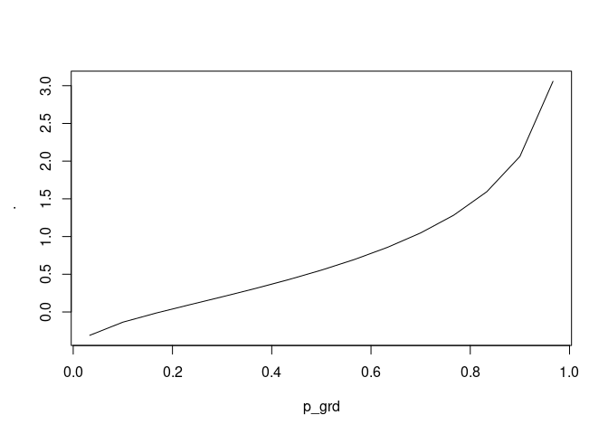
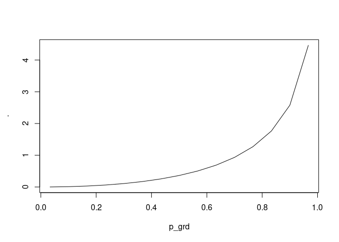
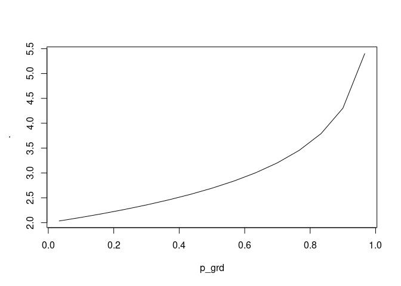

<!-- README.md is generated from README.Rmd. Please edit that file -->

# gilchrist <a href='https://dmi3kno.github.io/gilchrist'></a>

<!-- badges: start -->

[](https://lifecycle.r-lib.org/articles/stages.html#experimental)
<!-- badges: end -->

This package is made to honor the legacy and memory of Warren G.
Gilchrist (1932-2015)[^1].

The goal of `{gilchrist}` is to implement Gilchrist QF transformation
rules (Gilchrist 2000) in R in the form of pipeable function factories.

## Installation

You can install the development version of gilchrist like so:

``` r
remotes::install_packages("dmi3kno/gilchrist")
```

## Gilchrist’s QF transformation rules

Gilchrist (2000) list the following rules for creating new quantile
functions out of existing ones.

| Original QF | Rule | Resulting QF | Resulting variable |
|----|----|----|----|
| $Q_Y(u)$ | Relection rule | $-Q(1-u)$ | QF of $-Y$ |
| $Q_Y(u)$ | Reciprocal rule | $1/Q(1-u)$ | QF of $1/Y$ |
| $Q_1(u),Q_2(u)$ | Addition rule | $Q_1(u)+Q_2(u)$ | Valid QF |
| $Q_1(u),Q_2(u)$ | Linear combination rule | $aQ_1(u)+bQ_2(u)$ | Valid QF for a,b\>0 |
| $Q_1(u),Q_2(u)>0$ | Multiplication rule | $Q_1(u)Q_2(u)$ | Valid QF if $Q_1(u),Q_2(u)>0$ |
| $Q_Y(u)$ | Q-transformation | $T(Q_Y(u))$ | QF of $T(Y)$, for non-decreasing $T$ |
| $Q_Y(u)$ | p-transformation | $Q_Y(H(u))$ | p-transformed $Q_Y(u)$, for non-decreasing $H$ |

## Example

`{gilchrist}` is a special package! It uses `{magrittr}` pipe `%>%` to
operate not on data, but on functions. It is a function factory engine!

This is a basic example which shows you how to solve a common problem.

``` r
library(gilchrist)
library(magrittr)
## basic example code
```

In using and testing quantile function it is useful to have an
equi-spaced grid of probabilities

``` r
p_grd <- ppoints(15)
```

### Exponential

Start with standard exponential quantile function. Note that this “basic
quantile function” has no parameters.

$$S(u)=-\ln(1-u)$$

The built-in equivalent in `{gilchrist}` is `s_exp()`. It is a regular R
function, so we can inspect it.

``` r
s_exp
#> function (u, ...) 
#> {
#>     -log(1 - u)
#> }
#> <bytecode: 0x62cbe39c1198>
#> <environment: namespace:gilchrist>
#> attr(,"class")
#> [1] "qf"       "function"
#> attr(,"expects")
#> [1] "U"
#> attr(,"returns")
#> [1] NA
#> attr(,"math")
#> [1] "-\\ln(1- {&} )"
```

``` r
display(s_exp)
```

$$Q(u)=-\ln(1- {u} )$$

`{gilchrist}` has several basic (parameterless) functions that you can
modify.

- `s_exp()`: Basic QF of exponential distribution
- `s_unif()`: Basic QF of uniform distribution
- `s_norm()`: Basic QF of normal distribution, a thinly wrapped
  `qnorm(u,0,1)`.
- `s_cauchy()`: Basic QF of Cauchy distribution.
- `s_halftriang()`⁠: Basic QF of half-triangular distribution.
- `s_halfcosine()`: Basic QF of half-cosine distribution
- `s_sech()`: Basic QF of hyperbolic secant distribution.

We will now add a scale parameter to our basic exponential QF to make it
like in
[Wikipedia](https://en.wikipedia.org/wiki/Exponential_distribution).

$$Q(u)=\frac{1}{\lambda}[-\ln(1-u)]$$

We can add a scale parameter $\frac{1}{\lambda}$ (`qexp` has a
reciprocated scale).

``` r
qf_exp <- s_exp %>% 
  qtr_scale(nm_scale="lambda", .invert = TRUE)
```

``` r
display(qf_exp)
```

$$Q(u)=\frac{1}{ {\lambda}}\left[-\ln(1- {u} )\right]$$

We compare our hand-made exponential quantile function to the standard
function in R.

``` r
qf_exp(p_grd, lambda=10)
#>  [1] 0.003390155 0.010536052 0.018232156 0.026570317 0.035667494 0.045675840
#>  [7] 0.056798404 0.069314718 0.083624802 0.100330211 0.120397280 0.145528723
#> [13] 0.179175947 0.230258509 0.340119738
# compare to standard exponential quantile function. 
qexp(p_grd, 10)
#>  [1] 0.003390155 0.010536052 0.018232156 0.026570317 0.035667494 0.045675840
#>  [7] 0.056798404 0.069314718 0.083624802 0.100330211 0.120397280 0.145528723
#> [13] 0.179175947 0.230258509 0.340119738
```

### Logistic

Let’s do a more challenging example. We will make a logistic
distribution in `{gilchrist}`. Logistic distribution consists of
exponential $-\ln(1-u)$ and reflected exponential $\ln(u)$
distributions.

$$Q(u)=\mu+s\ln\left(\frac{u}{1-u}\right)=\mu+s\left[\ln(u)-\ln(1-u)\right]$$
This is how we do it. Note that in the resulting quantile function, the
arguments have to always be named.

``` r
qf_logistic <- s_exp %>% 
  qtr_reflect() %>%
  qtr_add(s_exp) %>% 
  qtr_decorate("mu", "s")

display(qf_logistic)
```

$$Q(u)={ {\mu} }+{\text{s} }\left[\left\{ -\left[-\ln(1- {\left[1-u\right]} )\right]\right\} +\left\{ -\ln(1- {u} )\right\} \right]$$

``` r
qf_logistic(p_grd, mu=4, s=2)
#>  [1] -2.7345917 -0.3944492  0.7811242  1.6208319  2.3054043  2.9069126
#>  [7]  3.4634720  4.0000000  4.5365280  5.0930874  5.6945957  6.3791681
#> [13]  7.2188758  8.3944492 10.7345917
qlogis(p_grd, 4, 2)
#>  [1] -2.7345917 -0.3944492  0.7811242  1.6208319  2.3054043  2.9069126
#>  [7]  3.4634720  4.0000000  4.5365280  5.0930874  5.6945957  6.3791681
#> [13]  7.2188758  8.3944492 10.7345917
```

### Flattened Skew-Logistic

Can we add a little flatness to our newly made logistic distribution and
introduce the weights by the exponential components? Lets make Flattened
Skew-Logistic Distribution described in Sharma and Chakrabarty (2020).

$$Q(u)=\alpha+\beta[(1-\delta)\ln(u)-\delta\ln(1-u)+ku]$$

Note that the exponential distribution will gain a weight `delta` and
the reflected exponential will gain a weight `1-delta`, because this is
the order in which they are listed in `qtr_mix`.

``` r
qf_fsld <- s_exp %>% 
  qtr_reflect() %>%
  qtr_cmix(s_exp, nm_wt="delta") %>% 
  qtr_add(qtr_scale(s_unif,"k")) %>% 
  qtr_decorate(nm_location="alpha", nm_scale="beta")
display(qf_fsld)
```

$$Q(u)={ {\alpha} }+{ {\beta} }\left[\left\{ (1-{ {\delta} })\left\{ -\left[-\ln(1- {\left[1-u\right]} )\right]\right\} +{ {\delta} }\left\{ -\ln(1- {u} )\right\} \right\} +\left\{ {\text{k} }\left[ {u} \right]\right\} \right]$$

``` r
qf_fsld(p_grd, delta=0.21, alpha=4, beta=2, k=1)
#>  [1] -1.292987  0.606167  1.578928  2.278908  2.847526  3.339955  3.783948
#>  [8]  4.195949  4.587143  4.966375  5.342122  5.724743  6.131138  6.600616
#> [15]  7.308272
qpd::qfsld(p_grd, bt=2, k=1, dlt=0.21, a=4)
#>  [1] -1.292987  0.606167  1.578928  2.278908  2.847526  3.339955  3.783948
#>  [8]  4.195949  4.587143  4.966375  5.342122  5.724743  6.131138  6.600616
#> [15]  7.308272
```

### Weibull

We can make Weibull distribution. Weibull distribution is a
Q-transformed exponential distribution. The transformation function is
the the Lehmann type 1 exponentiation $H(u)=u^{1/k}$.

$$Q(u)=\lambda[-\ln(1-u)]^{\frac{1}{k}}$$

working

$$
Q(u)={ {\lambda} }\left[\left[-\ln(1- {u} )\right]^{1/k}\right]
$$

Again, to remember that the power should be reciprocated, which comes by
default.

``` r
qf_weibull <- s_exp %>% 
  qtr_lehmann1("k") %>% 
  qtr_scale("lambda")
display(qf_weibull)
```

$$Q(u)={ {\lambda} }\left[\left[-\ln(1- {u} )\right]^{\frac{1}{\text{k}}}\right]$$

``` r
qf_weibull(p_grd, lambda=2, k=4)
#>  [1] 0.8581928 1.1394610 1.3068914 1.4359165 1.5456037 1.6441886 1.7362571
#>  [8] 1.8248886 1.9125543 2.0016490 2.0950007 2.1966819 2.3139284 2.4636778
#> [15] 2.7160512
qweibull(p_grd, scale=2,  shape=4)
#>  [1] 0.8581928 1.1394610 1.3068914 1.4359165 1.5456037 1.6441886 1.7362571
#>  [8] 1.8248886 1.9125543 2.0016490 2.0950007 2.1966819 2.3139284 2.4636778
#> [15] 2.7160512
```

Therefore, you can compose new quantile functions following Gilchrist
transformation rules.

## Function factories

The package implements several basic operations which can be performed
with quantile functions. First five of them implement Gilchrist’s rules:

### Reflection

A quantile function factory `qtr_reflect` implement the “reflection
rule”. Here’s an example of reflected exponential distribution.

``` r
qrexp <- s_exp %>% 
  qtr_reflect()
display(qrexp)
```

$$Q(u)=-\left[-\ln(1- {\left[1-u\right]} )\right]$$

``` r
qrexp(p_grd) %>% plot(p_grd,., type="l")
```


### Reciprocation

A quantile function factory `qtr_reciprocate` implement the
“reciprocatal rule”. Here’s an example of reciprocated uniform
distribution.

``` r
qrecunif <- s_unif %>% 
  qtr_reciprocate()
display(qrecunif)
```

$$Q(u)=\frac{1}{\left[ {\left[1-u\right]} \right]}$$

``` r
qrecunif(p_grd) %>% plot(p_grd,., type="l")
```


### Addition

A quantile function factory `qtr_add` implement the “addition rule”.
Here’s an example of sum of exponential and reflected exponential
distributions.

``` r
qlogistic <- s_exp %>% 
  qtr_reflect() %>% 
  qtr_add(s_exp)
display(qlogistic)
```

$$Q(u)=\left\{ -\left[-\ln(1- {\left[1-u\right]} )\right]\right\} +\left\{ -\ln(1- {u} )\right\} $$

``` r
qlogistic(p_grd) %>% plot(p_grd,., type="l")
```


### Linear combination

A quantile function factory `qtr_mix` implement the “linear combination
rule” with a particular values of $a$ and $b$ adding up to 1. Here’s an
example of sum of skew-logistic distribution implemented as a weighted
mix of exponential and reflected exponential distributions. Note that
the first function (in this case `s_exp`) gets the weight $\delta$ and
the second (reflected `s_exp`) gets the weight $1-\delta$.

``` r
qskewlogis <- s_exp %>% 
  qtr_reflect() %>% 
  qtr_cmix(s_exp, nm_wt="delta")

display(qskewlogis)
```

$$Q(u)=(1-{ {\delta} })\left\{ -\left[-\ln(1- {\left[1-u\right]} )\right]\right\} +{ {\delta} }\left\{ -\ln(1- {u} )\right\} $$

``` r
qskewlogis(p_grd, delta=0.9) %>% plot(p_grd,., type="l")
```



The twin function `qtr_cmix` swaps the weights: $1-\delta$ to the first
function and $\delta$ to the second function.

### Multiplication

A quantile function factory `qtr_multiply` implement the “multiplication
rule” for positive quantile functions. Here’s an example of multiplied
half-cosine and exponential distributions

``` r
qhcsexp <- s_halfcosine %>% 
  qtr_multiply(s_exp)

display(qhcsexp)
```

$$Q(u)=\left\{  \arcsin{ {u} } \right\} \times\left\{ -\ln(1- {u} )\right\} $$

``` r
qhcsexp(p_grd) %>% plot(p_grd,., type="l")
```



### Shift and scale

The quantile function factory `qtr_shift` implement the “addition rule”
but for parameters. It allows to add a location parameter to any part of
the QF. Here’s for example shifted exponential distribution (starting at
2).

``` r
q_shiftedexp <- s_exp %>% qtr_shift("mu")
q_shiftedexp(p_grd, mu=2) %>% plot(p_grd,., type="l")
```



The quantile function factory `qtr_scale` implement the “multiplication
rule” but for parameters: it can add a scale parameter to the QF,
provided it is positive. The scale can be inverted, if necessary (as the
case is with exponential distribution)

``` r
qexp1 <- s_exp %>% 
  qtr_scale("lambda", .invert = TRUE)
qexp1(p_grd, lambda=2) %>% plot(p_grd,., type="l")
```


Finally, `qtr_decorate` adds both location and scale to a quantile
function.

``` r
qlogistic <- s_exp %>%
  qtr_reflect() %>%
  qtr_add(s_exp) %>%
  qtr_decorate(nm_location = "mu", nm_scale = "s")

all.equal(
  qlogistic(p_grd, mu=3, s=2),
  qlogis(p_grd, location = 3, scale=2)
)
#> [1] TRUE
```

## Transformations

`gilchrist` also implements several popular Q-transformations and
p-transformations.

### Power (Lehmann transformations)

Raising the quantile function to power results in a valid distribution
only if the power is positive. Here’s Weibull, which is Lehmann Type I
transformed exponential.

``` r
qweibull1 <- s_exp %>% 
  qtr_lehmann1("k") %>% 
  qtr_scale("lambda")

qweibull1(p_grd, lambda=2, k=3) %>% 
  plot(p_grd,., type="l")
```


The analogous function exists for p-transforming the quantile function,
i.e. raising the depth $u$ to the power $.pow$ (or its inverse).

Lehmann transformations have been proposed for transforming CDF (Type I)
and the CCDF (Type II). When expressed in terms of quantile function,
these transformations become:

$$
H(u)=u^\frac{1}{\alpha}
$$

and

$$
H(u)=1-(1-u)^\frac{1}{\beta}
$$

Remarkaby, Kumaraswamy distribution is a combination of these two
transformations

$$
Q(u)=\left(1-\left(1-u\right)^\frac{1}{b}\right)^\frac{1}{a}
$$

``` r
qkumar1 <- s_unif %>%
  ptr_lehmann2("beta") %>%
  qtr_lehmann1("alpha")

display(qkumar1)
```

$$Q(u)=\left[ {\left[1-(1-u)^{\frac{1}{ {\beta}}}\right]} \right]^{\frac{1}{ {\alpha}}}$$

``` r
all.equal(
 extraDistr::qkumar(p_grd, 4,5),
  qkumar1(p_grd, alpha=4, beta=5)
)
#> [1] TRUE
```

An interesting distribution is (exponentiated) inverse Kumaraswamy
(Reddy, Rao, and Rosaiah 2024)

$$
Q(u)=\left[1-u^{\frac{1}{\lambda\beta}}\right]^{-\frac{1}{\alpha}}-1
$$

``` r
qeik <- s_unif %>%
  ptr_lehmann2("beta") %>%
  qtr_lehmann1("alpha") %>%
  qtr_reciprocate() %>%
  qtr_shift(shift=-1) %>%
  ptr_lehmann1("lambda")

q_eik <- function(u, lambda, beta, alpha){
  (1-u^(1/(beta*lambda)))^(-1/alpha)-1
}
display(qeik)
```

$$Q(u)={\text{.location} }+\left[\frac{1}{\left[\left[ {\left[1-(1-\left[1-u^{\frac{1}{ {\lambda}}}\right])^{\frac{1}{ {\beta}}}\right]} \right]^{\frac{1}{ {\alpha}}}\right]}\right]$$

``` r

all.equal(
 qeik(p_grd, alpha=4,beta=5, lambda=6),
 q_eik(p_grd, alpha=4,beta=5, lambda=6)
)
#> [1] TRUE

qeik(p_grd, alpha=4,beta=5, lambda=6) %>%
  plot(p_grd,.,type="l")
```


### Exponentiation

Raising the parameter to the power of quantile function.

### Function

Applying arbitrary function (without parameters) to the quantile
function `qtr_fun` or the depth `ptr_fun`.

Lets create a U-shaped Chen distribution described in Chen (2000). The
quantile function of Chen ditribution is

$$
Q(u)=\left[\ln\left(1-\frac{\ln(1-u)}{\lambda}\right)\right]^{1/\beta}
$$

``` r
qchen <- s_exp %>% 
  qtr_scale("lambda") %>% 
  qtr_fun(log1p) %>% 
  qtr_lehmann1("beta")
display(qchen)
```

$$Q(u)=\left[\text{log1p}(\left[{ {\lambda} }\left[-\ln(1- {u} )\right]\right])\right]^{\frac{1}{ {\beta}}}$$

### Shift/scale/power by a constant

The transformations where the shift, scale or power is a constant rather
than a parameter.

### SHASH-transformation

SHASH (sinh-asinh) q-transformation is used in Johnson SU distribution
and was further developed by Rigby and Stasinopoulos (2005) and Jones
and Pewsey (2009). The transformation has the form

$$
T(u)=\sinh\left[\frac{1}{\delta}\left[\text{asinh}(Q(u))-\epsilon\right]\right]
$$

Here’s for example SHASH-normal distribution

``` r
qshashnorm <- s_norm %>%
  qtr_shash(nm_tail="delta", nm_asymm="epsilon")
display(qshashnorm)
```

$$Q(u)=\text{sinh}\left( \frac{1}{ {\delta}} \left(\left[\Phi^{-1}\left( {u} \right)\right] - { {\epsilon} } \right)\right)  $$

``` r
qs <- qshashnorm(p_grd, delta=2, epsilon=2)
plot(p_grd, qs, type="l")
```


### $\varepsilon$-transformation

Unit transformation described by Bakouch et al. (2023) for positive
distributions.

$$
T(u)=\frac{(1+u)^{1/\beta}-1}{(1+u)^{1/\beta}+1}
$$

In particular they present the unit exponential QF as

``` r
quexp <- s_exp %>%
  qtr_scale("lambda", .invert=TRUE) %>%
  qtr_epsilon("beta")
display(quexp)
```

$$Q(u)=\frac{ \left(1+\left[\frac{1}{ {\lambda}}\left[-\ln(1- {u} )\right]\right] \right)^\frac{1}{ {\beta}}-1}{ \left( 1+\left[\frac{1}{ {\lambda}}\left[-\ln(1- {u} )\right]\right] \right)^\frac{1}{ {\beta}} +1}$$

We could transform another semi-bounded distribution, like Pareto

``` r
# for positive alpha
qupareto <- s_unif %>%
  qtr_reciprocate() %>%
  qtr_lehmann1("alpha") %>%
  qtr_epsilon("beta")
display(qupareto)
```

$$Q(u)=\frac{ \left(1+\left[\left[\frac{1}{\left[ {\left[1-u\right]} \right]}\right]^{\frac{1}{ {\alpha}}}\right] \right)^\frac{1}{ {\beta}}-1}{ \left( 1+\left[\left[\frac{1}{\left[ {\left[1-u\right]} \right]}\right]^{\frac{1}{ {\alpha}}}\right] \right)^\frac{1}{ {\beta}} +1}$$

``` r
qs <- qupareto(p_grd, 3, 0.1)
plot(p_grd, qs, type="l")
```


### DUS-transformation

Finally, we can apply the DUS-transformation proposed by Kumar, Singh,
and Singh (2015)

$$
H(u)=\ln(1-u+eu)
$$

The authors used it to transform exponential distribution

``` r
qDUSexp <- s_exp %>%
  qtr_scale("lambda", .invert = TRUE) %>%
  ptr_DUS()

qs <- qDUSexp(p_grd, lambda=0.5)
display(qDUSexp)
```

$$Q(u)=\frac{1}{ {\lambda}}\left[-\ln(1- {\left[\ln \left( 1 - u + eu \right)\right]} )\right]$$

``` r
plot(p_grd, qs, type="l")
lines(p_grd, qexp(p_grd, 0.5), col=2)
```


### Kavya-Manoharan (KM) p-transformation

This p-transformation proposed in Kavya and Manoharan (2021) is the
reflected and shifted DUS transformation we considered above. It could
as well be called DUS Type II transformation

$$
H(u)=-\ln\left(1-u\frac{e-1}{e}\right)
$$

The authors apply this p-transformation to Weibuill distribution

``` r
qf_KMweibull <- s_exp %>% 
  qtr_lehmann1("k") %>% 
  qtr_scale("lambda") %>% 
  ptr_KM()
display(qf_KMweibull)
```

$$Q(u)={ {\lambda} }\left[\left[-\ln(1- {\left[-\ln \left(1-u\frac{e-1}{e} \right)\right]} )\right]^{\frac{1}{\text{k}}}\right]$$

``` r
qf_KMweibull(p_grd, lambda=3, k=4)%>%
  plot(p_grd,., type="l")
```


### Modi-transformation

Modi-transformation is a p-transformation of the following form

$$
H(u)=\frac{u\alpha^\beta}{1-u+\alpha^\beta}
$$

Modi-transformed exponentiated exponential distribution

``` r
qmodiexpexp <- s_exp %>%
  qtr_scale("lambda") %>%
  ptr_lehmann1("delta") %>%
  ptr_modi1("alpha", "beta")
  
qmodiexpexp1 <- function(u, lambda, alpha, beta, delta){
  1/lambda*(-log(1-(u*alpha^beta/(1-u+alpha^beta))^(1/delta)))
}
display(qmodiexpexp)
```

$$Q(u)={ {\lambda} }\left[-\ln(1- {\left[\frac{u { {\alpha} }^{ {\beta} } }{ 1- u +{ {\alpha} }^{ {\beta} }}\right]^{\frac{1}{ {\delta}}}} )\right]$$

``` r
qmodiexpexp(p_grd, lambda=3, alpha=2, beta=0.1, delta=5)
#>  [1]  1.768450  2.452959  2.925599  3.335142  3.722179  4.106920  4.503626
#>  [8]  4.925483  5.387532  5.909832  6.522736  7.278248  8.280512  9.797473
#> [15] 13.069582
qmodiexpexp1(p_grd, lambda=3, alpha=2, beta=0.1, delta=5)
#>  [1] 0.1964944 0.2725510 0.3250666 0.3705714 0.4135754 0.4563245 0.5004029
#>  [8] 0.5472759 0.5986147 0.6566480 0.7247485 0.8086942 0.9200569 1.0886081
#> [15] 1.4521758
```

## Other examples

Dagum distribution seems to be a product of inverse Kumaraswamy and
Lehmann Type I transformed uniform distribution.

$$
\begin{gathered}
Q(u)=b(u^{-\frac{1}{p}}-1)^{-\frac{1}{a}}\\
Q(u)=\frac{bu^{\frac{1}{pa}}}{\left(1-u^{\frac{1}{p}}\right)^\frac{1}{a}}
\end{gathered}
$$

``` r
qdagum_raw <- function(u, b, p, a){
  mip <- -1/p
  mia <- -1/a
  b*(u^mip-1)^mia
}

qdagum <- s_unif %>%
  ptr_lehmann2("p") %>%
  qtr_lehmann1("a") %>%
  qtr_reciprocate() %>%
  qtr_multiply(
    qtr_lehmann1(s_unif, "a") %>%
      qtr_lehmann1("p")
  ) %>%
  qtr_scale("b")

qs1 <- qdagum_raw(p_grd, b=2, p=3, a=4)
qs2 <- qdagum(p_grd, b=2, p=3, a=4)
all.equal(qs1,qs2)
#> [1] TRUE
```

Interesting “bathtube-shaped” distribution proposed by Muhammad (2023)

$$
Q(u)=\theta\exp\left[\frac{1}{\beta}\left(1-u^{-\frac{1}{\alpha}}\right)\right]
$$

``` r
qmuhammad <- s_unif %>% 
  qtr_reciprocate() %>% 
  qtr_reflect() %>% 
  qtr_shift(shift=1) %>% 
  qtr_scale("beta") %>% 
  qtr_fun(exp) %>% 
  qtr_scale("theta") %>% 
  ptr_lehmann1("alpha")
display(qmuhammad)
```

$$Q(u)={ {\theta} }\left[\text{exp}(\left[{ {\beta} }\left[{\text{.location} }+\left[-\left[\frac{1}{\left[ {\left[1-\left[1-u^{\frac{1}{ {\alpha}}}\right]\right]} \right]}\right]\right]\right]\right])\right]$$

``` r
qmuhammad(runif(1e3), theta=2, beta=7, alpha=0.7) %>% hist(50)
```


Fréchet is Reciprocate transform of Weibull. Weibull is power transform
of Exponential.

$$
Q(u)=m+s(-\ln u)^{-1/\alpha}
$$

``` r
qfrechet <- s_exp %>%
  qtr_lehmann1("alpha") %>%
  qtr_reciprocate() %>%
  qtr_decorate("m", "s")

qfrechet(p_grd, m=0, s=1, alpha=5)%>%plot(p_grd, ., type="l")
```


What other cool transformations do you know? Please let me know!

## References

<div id="refs" class="references csl-bib-body hanging-indent"
entry-spacing="0">

<div id="ref-bakouch2023UnitExponentialProbability" class="csl-entry">

Bakouch, Hassan, Tassaddaq Hussain, Marina Tošić, Vladica Stojanović,
and Najla Qarmalah. 2023. “Unit Exponential Probability Distribution:
Characterization and Applications in Environmental and Engineering Data
Modelling.” Preprint. Computer Science and Mathematics.
<https://doi.org/10.20944/preprints202308.0778.v1>.

</div>

<div id="ref-chen2000NewTwoparameterLifetime" class="csl-entry">

Chen, Zhenmin. 2000. “A New Two-Parameter Lifetime Distribution with
Bathtub Shape or Increasing Failure Rate Function.” *Statistics &
Probability Letters* 49 (2): 155–61.
<https://doi.org/10.1016/S0167-7152(00)00044-4>.

</div>

<div id="ref-davies2016WarrenGilchrist19322015" class="csl-entry">

Davies, Neville. 2016. “Warren G. Gilchrist, 1932-2015.” *Journal of the
Royal Statistical Society. Series A (Statistics in Society)* 179 (3):
872–74. <https://doi.org/10.1111/rssa.12243>.

</div>

<div id="ref-gilchrist2000StatisticalModellingQuantile"
class="csl-entry">

Gilchrist, Warren. 2000. *Statistical Modelling with Quantile
Functions*. Boca Raton: Chapman & Hall/CRC.

</div>

<div id="ref-jones2009SinharcsinhDistributions" class="csl-entry">

Jones, M. C., and Arthur Pewsey. 2009. “Sinh-Arcsinh Distributions.”
*Biometrika* 96 (4): 761–80. <https://doi.org/10.1093/biomet/asp053>.

</div>

<div id="ref-kavya2021ParsimoniousModelsLifetimes" class="csl-entry">

Kavya, P., and M. Manoharan. 2021. “Some Parsimonious Models for
Lifetimes and Applications.” *Journal of Statistical Computation and
Simulation* 91 (18): 3693–3708.
<https://doi.org/10.1080/00949655.2021.1946064>.

</div>

<div id="ref-kumar2015MethodProposingNew" class="csl-entry">

Kumar, Dinesh, Umesh Singh, and Sanjay Kumar Singh. 2015. “A Method of
Proposing New Distribution and Its Application to Bladder Cancer
Patients Data.” *J. Stat. Appl. Pro. Lett* 2 (3): 235–45.

</div>

<div id="ref-muhammad2023NewThreeparameterModel" class="csl-entry">

Muhammad, Mustapha. 2023. “A New Three-Parameter Model with Support on a
Bounded Domain: Properties and Quantile Regression Model.” *Journal of
Computational Mathematics and Data Science* 6 (January): 100077.
<https://doi.org/10.1016/j.jcmds.2023.100077>.

</div>

<div id="ref-reddy2024AcceptanceSamplingPlans" class="csl-entry">

Reddy, M Rami, B Srinivasa Rao, and K Rosaiah. 2024. “Acceptance
Sampling Plans Based on Percentiles of Exponentiated Inverse Kumaraswamy
Distribution.” *Indian Journal Of Science And Technology* 17 (16):
1681–89. <https://doi.org/10.17485/IJST/v17i16.222>.

</div>

<div id="ref-rigby2005GeneralizedAdditiveModels" class="csl-entry">

Rigby, R. A., and D. M. Stasinopoulos. 2005. “Generalized Additive
Models for Location, Scale and Shape.” *Journal of the Royal Statistical
Society: Series C (Applied Statistics)* 54 (3): 507–54.
<https://doi.org/10.1111/j.1467-9876.2005.00510.x>.

</div>

<div id="ref-sharma2020QuantileBasedApproachSupervised"
class="csl-entry">

Sharma, Dreamlee, and Tapan Kumar Chakrabarty. 2020. “A Quantile-Based
Approach to Supervised Learning.” In *Applications of Machine Learning*,
edited by Prashant Johri, Jitendra Kumar Verma, and Sudip Paul, 321–40.
Singapore: Springer Singapore.
<https://doi.org/10.1007/978-981-15-3357-0_21>.

</div>

</div>

[^1]: See Davies (2016) for a short biography of this truly remarkable
    individual
