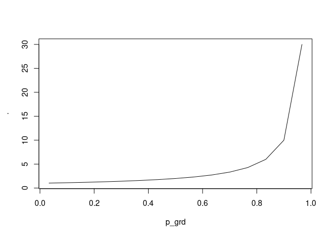

<!-- README.md is generated from README.Rmd. Please edit that file -->

# gilchrist <a href='https://dmi3kno.github.io/gilchrist'></a>

<!-- badges: start -->

[](https://lifecycle.r-lib.org/articles/stages.html#experimental)
<!-- badges: end -->

This package is made to honor the legacy and memory of Warren G.
Gilchrist (1932-2015)[^1].

The goal of `{gilchrist}` is to implement Gilchrist QF transformation
rules (Gilchrist 2000) in R in the form of pipeable function factories.

## Installation

You can install the development version of gilchrist like so:

``` r
remotes::install_packages("dmi3kno/gilchrist")
```

## Gilchrist’s QF transformation rules

Gilchrist (2000) list the following rules for creating new quantile
functions out of existing ones.

| Original QF       | Rule                    | Resulting QF      | Resulting variable                             |
|-------------------|-------------------------|-------------------|------------------------------------------------|
| $Q_Y(u)$          | Relection rule          | $-Q(1-u)$         | QF of $-Y$                                     |
| $Q_Y(u)$          | Reciprocal rule         | $1/Q(1-u)$        | QF of $1/Y$                                    |
| $Q_1(u),Q_2(u)$   | Addition rule           | $Q_1(u)+Q_2(u)$   | Valid QF                                       |
| $Q_1(u),Q_2(u)$   | Linear combination rule | $aQ_1(u)+bQ_2(u)$ | Valid QF for a,b\>0                            |
| $Q_1(u),Q_2(u)>0$ | Multiplication rule     | $Q_1(u)Q_2(u)$    | Valid QF if $Q_1(u),Q_2(u)>0$                  |
| $Q_Y(u)$          | Q-transformation        | $T(Q_Y(u))$       | QF of $T(Y)$, for non-decreasing $T$           |
| $Q_Y(u)$          | p-transformation        | $Q_Y(H(u))$       | p-transformed $Q_Y(u)$, for non-decreasing $H$ |

## Example

`{gilchrist}` is a special package! It uses `{magrittr}` pipe `%>%` to
operate not on data, but on functions. It is a function factory engine!

This is a basic example which shows you how to solve a common problem.

``` r
library(gilchrist)
library(magrittr)
## basic example code
```

In using and testing quantile function it is useful to have an
equi-spaced grid of probabilities

``` r
p_grd <- ppoints(10)
```

### Exponential

Start with standard exponential quantile function. Note that this “basic
quantile function” has no parameters.

$$S(u)=-\ln(1-u)$$

The built-in equivalent in `{gilchrist}` is `s_exp()`. It is a regular R
function, so we can inspect it.

``` r
s_exp
#> function(u, ...){
#>   -log(1-u)
#> }
#> <bytecode: 0x619a2e5b1a98>
#> <environment: namespace:gilchrist>
```

`{gilchrist}` has several basic (parameterless) functions that you can
modify.

- `s_exp()`: Basic QF of exponential distribution
- `s_unif()`: Basic QF of uniform distribution
- `s_norm()`: Basic QF of normal distribution, a thinly wrapped
  `qnorm(u,0,1)`.
- `s_cauchy()`: Basic QF of Cauchy distribution.
- `s_halftriang()`⁠: Basic QF of half-triangular distribution.
- `s_halfcosine()`: Basic QF of half-cosine distribution
- `s_sech()`: Basic QF of hyperbolic secant distribution.

We will now add a scale parameter to our basic exponential QF to make it
like in
[Wikipedia](https://en.wikipedia.org/wiki/Exponential_distribution).

$$Q(u)=\frac{1}{\lambda}[-\ln(1-u)]$$

We can add a scale parameter $\frac{1}{\lambda}$ (`qexp` has a
reciprocated scale).

``` r
qf_exp <- s_exp %>% 
  qff_scale(nm_scale="lambda", .invert = TRUE)
```

We compare our hand-made exponential quantile function to the standard
function in R.

``` r
qf_exp(p_grd, lambda=10)
#>  [1] 0.006291383 0.017261274 0.029584538 0.043642733 0.060005676 0.079580133
#>  [7] 0.103942342 0.136219681 0.184176989 0.279728133
# compare to standard exponential quantile function. 
qexp(p_grd, 10)
#>  [1] 0.006291383 0.017261274 0.029584538 0.043642733 0.060005676 0.079580133
#>  [7] 0.103942342 0.136219681 0.184176989 0.279728133
```

### Logistic

Let’s do a more challenging example. We will make a logistic
distribution in `{gilchrist}`. Logistic distribution consists of
exponential $-\ln(1-u)$ and reflected exponential $\ln(u)$
distributions.

$$Q(u)=\mu+s\ln\left(\frac{u}{1-u}\right)=\mu+s\left[\ln(u)-\ln(1-u)\right]$$
This is how we do it. Note that in the resulting quantile function, the
arguments have to always be named.

``` r
qf_logistic <- s_exp %>% 
  qff_reflect() %>%
  qff_add(s_exp) %>% 
  qff_decorate("mu", "s")

qf_logistic(p_grd, mu=4, s=2)
#>  [1] -1.4687350  0.6616857  1.8672971  2.7940078  3.6085108  4.3914892
#>  [7]  5.2059922  6.1327029  7.3383143  9.4687350
qlogis(p_grd, 4, 2)
#>  [1] -1.4687350  0.6616857  1.8672971  2.7940078  3.6085108  4.3914892
#>  [7]  5.2059922  6.1327029  7.3383143  9.4687350
```

### Flattened Skew-Logistic

Can we add a little flatness to our newly made logistic distribution and
introduce the weights by the exponential components? Lets make Flattened
Skew-Logistic Distribution described in Sharma and Chakrabarty (2020).

$$Q(u)=\alpha+\beta[(1-\delta)\ln(u)-\delta\ln(1-u)+ku]$$

Note that the exponential distribution will gain a weight `delta` and
the reflected exponential will gain a weight `1-delta`, because this is
the order in which they are listed in `qff_mix`.

``` r
qf_fsld <- s_exp %>% 
  qff_reflect() %>%
  qff_mix(s_exp, nm_wt="delta") %>% 
  qff_add(qff_scale(s_unif,"k")) %>% 
  qff_decorate(nm_location="alpha", nm_scale="beta")

qf_fsld(p_grd, delta=0.21, alpha=4, beta=2, k=1)
#>  [1]  3.046497  3.816258  4.407508  4.960314  5.516292  6.102903  6.751672
#>  [8]  7.515821  8.520426 10.271329
qpd::qfsld(p_grd, bt=2, k=1, dlt=0.21, a=4)
#>  [1] -0.2713295  1.4795741  2.4841792  3.2483276  3.8970968  4.4837079
#>  [7]  5.0396856  5.5924918  6.1837420  6.9535031
```

### Weibull

We can make Weibull distribution. Weibull distribution is a
Q-transformed exponential distribution. The transformation function is
the the Lehmann type 1 exponentiation $H(u)=u^{1/k}$.

$$Q(u)=\lambda[-\ln(1-u)]^{1/k}$$ Again, to remember that the power
should be reciprocated, which comes by default.

``` r
qf_weibull <- s_exp %>% 
  qtr_lehmann1("k") %>% 
  qff_scale("lambda")
qf_weibull(p_grd, lambda=2, k=4)
#>  [1] 1.001651 1.289134 1.475014 1.625579 1.760265 1.888997 2.019427 2.160678
#>  [9] 2.329908 2.586509
qweibull(p_grd, scale=2,  shape=4)
#>  [1] 1.001651 1.289134 1.475014 1.625579 1.760265 1.888997 2.019427 2.160678
#>  [9] 2.329908 2.586509
```

Therefore, you can compose new quantile functions following Gilchrist
transformation rules.

## Function factories

The package implements several basic operations which can be performed
with quantile functions. First five of them implement Gilchrist’s rules:

### Reflection

A quantile function factory `qff_reflect` implement the “reflection
rule”. Here’s an example of reflected exponential distribution.

``` r
qrexp <- s_exp %>% 
  qff_reflect()
qrexp(p_grd) %>% plot(p_grd,., type="l")
```


### Reciprocation

A quantile function factory `qff_reciprocate` implement the
“reciprocatal rule”. Here’s an example of reciprocated uniform
distribution.

``` r
qrecunif <- s_unif %>% 
  qff_reciprocate()
qrecunif(p_grd) %>% plot(p_grd,., type="l")
```


### Addition

A quantile function factory `qff_add` implement the “addition rule”.
Here’s an example of sum of exponential and reflected exponential
distributions.

``` r
qlogistic <- s_exp %>% 
  qff_reflect() %>% 
  qff_add(s_exp)
qlogistic(p_grd) %>% plot(p_grd,., type="l")
```


### Linear combination

A quantile function factory `qff_mix` implement the “linear combination
rule” with a particular values of $a$ and $b$ adding up to 1. Here’s an
example of sum of skew-logistic distribution implemented as a weighted
mix of exponential and reflected exponential distributions. Note that
the first function (in this case `s_exp`) gets the weight $\delta$ and
the second (reflected `s_exp`) gets the weight $1-\delta$.

``` r
qskewlogis <- s_exp %>% 
  qff_reflect() %>% 
  qff_mix(s_exp, nm_wt="delta")

qskewlogis(p_grd, delta=0.9) %>% plot(p_grd,., type="l")
```


The twin function `qff_cmix` swaps the weights: $1-\delta$ to the first
function and $\delta$ to the second function.

### Multiplication

A quantile function factory `qff_multiply` implement the “multiplication
rule” for positive quantile functions. Here’s an example of multiplied
half-cosine and exponential distributions

``` r
qhcsexp <- s_halfcosine %>% 
  qff_multiply(s_exp)

qhcsexp(p_grd) %>% plot(p_grd,., type="l")
```


### Shift and scale

The quantile function factory `qff_shift` implement the “addition rule”
but for parameters. It allows to add a location parameter to any part of
the QF. Here’s for example shifted exponential distribution (starting at
2).

``` r
q_shiftedexp <- s_exp %>% qff_shift("mu")
q_shiftedexp(p_grd, mu=2) %>% plot(p_grd,., type="l")
```



The quantile function factory `qff_scale` implement the “multiplication
rule” but for parameters: it can add a scale parameter to the QF,
provided it is positive. The scale can be inverted, if necessary (as the
case is with exponential distribution)

``` r
qexp1 <- s_exp %>% 
  qff_scale("lambda", .invert = TRUE)
qexp1(p_grd, lambda=2) %>% plot(p_grd,., type="l")
```


Finally, `qff_decorate` adds both location and scale to a quantile
function.

## Transformations

`gilchrist` also implements several popular Q-transformations and
p-transformations.

### Power

Raising the quantile function to power results in a valid distribution
only if the power is positive. Here’s Weibull, which is powered
exponential.

``` r
qweibull1 <- s_exp %>% 
  qtr_lehmann1("k") %>% 
  qff_scale("lambda")
qweibull1(p_grd, lambda=2, k=3) %>% plot(p_grd,., type="l")
```


The analogous function exists for p-transforming the quantile function,
i.e. raising the depth $u$ to the power $.pow$ (or its inverse).

Lehmann transformations have been proposed for transforming CDF (Type I)
and the CCDF (Type II). When expressed in terms of quantile function,
these transformations become:

$$
H(u)=u^\frac{1}{\alpha}
$$ and

$$
H(u)=1-(1-u)^\frac{1}{\beta}
$$

Remarkaby, Kumaraswamy distribution is a combination of these two
transformations

$$
Q(u)=\left(1-\left(1-u\right)^\frac{1}{b}\right)^\frac{1}{a}
$$

``` r
qkumar1 <- s_unif %>%
  ptr_lehmann2("beta") %>%
  qtr_lehmann1("alpha")

all.equal(
 extraDistr::qkumar(p_grd, 4,5),
  qkumar1(p_grd, alpha=4, beta=5)
)
#> [1] TRUE
```

An interesting distribution is (exponentiated) inverse Kumaraswamy
(Reddy, Rao, and Rosaiah 2024)

$$
Q(u)=\left[1-u^{\frac{1}{\lambda\beta}}\right]^{-\frac{1}{\alpha}}-1
$$

``` r
qeik <- s_unif %>%
  ptr_lehmann2("beta") %>%
  qtr_lehmann1("alpha") %>%
  qff_reciprocate() %>%
  qtr_shiftby(-1) %>%
  ptr_lehmann1("lambda")

q_eik <- function(u, lambda, beta, alpha){
  (1-u^(1/(beta*lambda)))^(-1/alpha)-1
}

all.equal(
 qeik(p_grd, alpha=4,beta=5, lambda=6),
 q_eik(p_grd, alpha=4,beta=5, lambda=6)
)
#> [1] TRUE

qeik(p_grd, alpha=4,beta=5, lambda=6) %>%
  plot(p_grd,.,type="l")
```


### Exponentiation

Raising the parameter to the power of quantile function.

### Function

Applying arbitrary function (without parameters) to the quantile
function `qff_fun` or the depth `ptr_fun`.

Lets create a U-shaped Chen distribution described in Chen (2000). The
quantile function of Chen ditribution is

$$
Q(u)=\left[\ln\left(1-\frac{\ln(1-u)}{\lambda}\right)\right]^{1/\beta}
$$

``` r
qchen <- s_exp %>% 
  qff_scale("lambda") %>% 
  qtr_fun(log1p) %>% 
  qtr_lehmann1("beta")
```

### Shift/scale/power by a constant

The transformations where the shift, scale or power is a constant rather
than a parameter.

### Kavya-Manoharan (KM) p-transformation

The p-transformation proposed in Kavya and Manoharan (2021)

$$
T(y)=-\ln\left(1-y\frac{e-1}{e}\right)
$$

The authors apply this p-transformation to Weibuill distribution

``` r
qf_KMweibull <- s_exp %>% 
  qtr_lehmann1("k") %>% 
  qff_scale("lambda") %>% 
  ptr_KM()

qf_KMweibull(p_grd, lambda=3, k=4)%>%
  plot(p_grd,., type="l")
```


### $\varepsilon$-transformation

Unit transformation described by Bakouch et al. (2023) for positive
distributions.

$$
T(x)=\frac{(1+x)^{1/\beta}-1}{(1+x)^{1/\beta}+1}
$$

In particular they present the unit exponential QF as

``` r
quexp <- s_exp %>%
  qff_scale("lambda", .invert=TRUE) %>%
  qtr_epsilon("beta")
```

We could transform another semi-bounded distribution, like Pareto

``` r
# for positive alpha
qupareto <- s_unif %>%
  qff_reciprocate() %>%
  qtr_lehmann1("alpha") %>%
  qtr_epsilon("beta")
  
qs <- qupareto(p_grd, 3, 0.1)
plot(p_grd, qs, type="l")
```


Finally, we can apply the DUS-transformation proposed by Kumar, Singh,
and Singh (2015)

$$
T(x)=\ln(1-x+ex)
$$

The authors used it to transform exponential distribution

``` r
qDUSexp <- s_exp %>%
  qff_scale("lambda", .invert = TRUE) %>%
  ptr_DUS()

qs <- qDUSexp(p_grd, lambda=0.5)
plot(p_grd, qs, type="l")
lines(p_grd, qexp(p_grd, 0.5), col=2)
```


### Modi-transformation

Modi-transformed exponentiated exponential distribution

``` r
qmodiexpexp <- s_exp %>%
  qff_scale("lambda") %>%
  ptr_lehmann1("delta") %>%
  ptr_modi()
  
qmodiexpexp1 <- function(u, lambda, alpha, beta, delta){
  1/lambda*(-log(1-(u*alpha^beta/(1-u+alpha^beta))^(1/delta)))
}

qmodiexpexp(p_grd, lambda=3, alpha=2, beta=0.1, delta=5)
#>  [1]  2.103170  2.872580  3.468606  4.031320  4.613770  5.258616  6.021092
#>  [8]  6.999446  8.429094 11.268667
qmodiexpexp1(p_grd, lambda=3, alpha=2, beta=0.1, delta=5)
#>  [1] 0.2336856 0.3191756 0.3854007 0.4479244 0.5126411 0.5842906 0.6690102
#>  [8] 0.7777162 0.9365660 1.2520741
```

## Other examples

Interesting “bathtube-shaped” distribution proposed by Muhammad (2023)

$$
Q(u)=\theta\exp\left[\frac{1}{\beta}(1-u^{-\frac{1}{\alpha}})\right]
$$

``` r
qmuhammad <- s_unif %>% 
  qff_reciprocate() %>% 
  qff_reflect() %>% 
  qtr_shiftby(1) %>% 
  qff_scale("beta") %>% 
  qtr_fun(exp) %>% 
  qff_scale("theta") %>% 
  ptr_lehmann1("alpha")

qmuhammad(runif(1e3), theta=2, beta=7, alpha=0.7) %>% hist(50)
```


Fréchet is Reciprocate transform of Weibull. Weibull is power transform
of Exponential.

$$
Q(u)=m+s(-\ln u)^{-1/\alpha}
$$

``` r
qfrechet <- s_exp %>%
  qtr_lehmann1("alpha") %>%
  qff_reciprocate() %>%
  qff_decorate("m", "s")

qfrechet(p_grd, m=0, s=1, alpha=5)%>%plot(p_grd, ., type="l")
```


What other cool transformations do you know? Please let me know!

## References

<div id="refs" class="references csl-bib-body hanging-indent">

<div id="ref-bakouch2023UnitExponentialProbability" class="csl-entry">

Bakouch, Hassan, Tassaddaq Hussain, Marina Tošić, Vladica Stojanović,
and Najla Qarmalah. 2023. “Unit Exponential Probability Distribution:
Characterization and Applications in Environmental and Engineering Data
Modelling.” Preprint. Computer Science and Mathematics.
<https://doi.org/10.20944/preprints202308.0778.v1>.

</div>

<div id="ref-chen2000NewTwoparameterLifetime" class="csl-entry">

Chen, Zhenmin. 2000. “A New Two-Parameter Lifetime Distribution with
Bathtub Shape or Increasing Failure Rate Function.” *Statistics &
Probability Letters* 49 (2): 155–61.
<https://doi.org/10.1016/S0167-7152(00)00044-4>.

</div>

<div id="ref-davies2016WarrenGilchrist19322015" class="csl-entry">

Davies, Neville. 2016. “Warren G. Gilchrist, 1932-2015.” *Journal of the
Royal Statistical Society. Series A (Statistics in Society)* 179 (3):
872–74. <https://doi.org/10.1111/rssa.12243>.

</div>

<div id="ref-gilchrist2000StatisticalModellingQuantile"
class="csl-entry">

Gilchrist, Warren. 2000. *Statistical Modelling with Quantile
Functions*. Boca Raton: Chapman & Hall/CRC.

</div>

<div id="ref-kavya2021ParsimoniousModelsLifetimes" class="csl-entry">

Kavya, P., and M. Manoharan. 2021. “Some Parsimonious Models for
Lifetimes and Applications.” *Journal of Statistical Computation and
Simulation* 91 (18): 3693–3708.
<https://doi.org/10.1080/00949655.2021.1946064>.

</div>

<div id="ref-kumar2015MethodProposingNew" class="csl-entry">

Kumar, Dinesh, Umesh Singh, and Sanjay Kumar Singh. 2015. “A Method of
Proposing New Distribution and Its Application to Bladder Cancer
Patients Data.” *J. Stat. Appl. Pro. Lett* 2 (3): 235–45.

</div>

<div id="ref-muhammad2023NewThreeparameterModel" class="csl-entry">

Muhammad, Mustapha. 2023. “A New Three-Parameter Model with Support on a
Bounded Domain: Properties and Quantile Regression Model.” *Journal of
Computational Mathematics and Data Science* 6 (January): 100077.
<https://doi.org/10.1016/j.jcmds.2023.100077>.

</div>

<div id="ref-reddy2024AcceptanceSamplingPlans" class="csl-entry">

Reddy, M Rami, B Srinivasa Rao, and K Rosaiah. 2024. “Acceptance
Sampling Plans Based on Percentiles of Exponentiated Inverse Kumaraswamy
Distribution.” *Indian Journal Of Science And Technology* 17 (16):
1681–89. <https://doi.org/10.17485/IJST/v17i16.222>.

</div>

<div id="ref-sharma2020QuantileBasedApproachSupervised"
class="csl-entry">

Sharma, Dreamlee, and Tapan Kumar Chakrabarty. 2020. “A Quantile-Based
Approach to Supervised Learning.” In *Applications of Machine Learning*,
edited by Prashant Johri, Jitendra Kumar Verma, and Sudip Paul, 321–40.
Singapore: Springer Singapore.
<https://doi.org/10.1007/978-981-15-3357-0_21>.

</div>

</div>

[^1]: See Davies (2016) for a short biography of this truly remarkable
    individual
